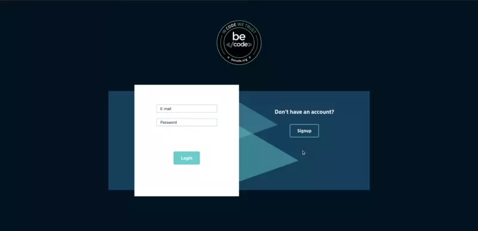
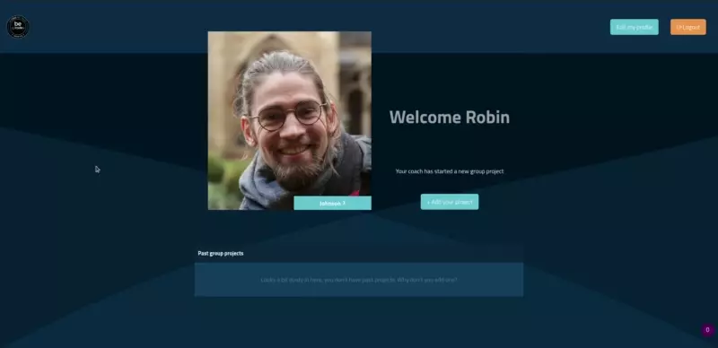
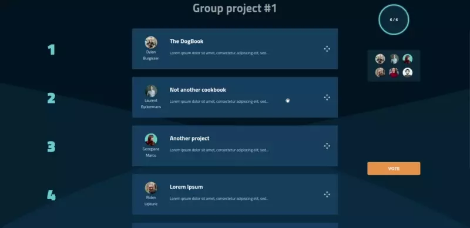

# BeTogether

## What is it?

BeTogether is a web app made for [BeCode](https://becode.org/)'s coaches and their students. Every once in a while, here's how it unfolds:

1. they ask the students to submit one project each
2. the students then vote for their favourite projects
3. the coach makes groups according to their preferences

This process can be a hassle, and is repeated several times in each promotion. This is what this app offers to solve.

## Developers and roles

Georgiana Marcu and Robin Lejeune worked on the frontend (this repo), using **React**.

  > Check it on [https://betogether-becode.herokuapp.com/](https://betogether-becode.herokuapp.com/).

[The backend](https://github.com/AnthonyHoyas/BeTogether_back) was made by Anthony Hoyas, with **Python (Django)**.

## The mission

- Desktop-only web app
- Allow to dispatch students in promotions
- Allow students to create a project within a group project (tied to one promotion)
- Make a wishlist
- Create groups according to the students' wishlist

## Preview

### Login / Signup page

### Dashboard, first steps (submit a project)

### Dashboard, last steps (arrange the vote list and get the resulting groups)
